# ENTITY RELATIONSHIP DIAGRAM (ERD)

Version: 1.1
Status: Draft - Matches DATABASE_DESIGN.md v1.1

Project:
Multi-Tenant School Administration Management SaaS Platform

Framework:
Laravel 13

Database:
MySQL 8

Architecture:
Single Database Multi-Tenant SaaS

Tenant Identifier:
school_id

---

# 1. PURPOSE

This document defines the logical Entity Relationship Diagram for the 28-table database design in `DATABASE_DESIGN.md`.

The ERD is the visual reference for:

* Database relationships
* Foreign key planning
* Tenant isolation
* MCA report explanation
* Future migration implementation

---

# 2. COMPLETE ER DIAGRAM

```mermaid
erDiagram
    SCHOOLS {
        bigint id PK
        varchar name
        varchar code UK
        varchar email UK
        varchar phone
        text address
        varchar city
        varchar state
        varchar country
        varchar postal_code
        varchar principal_name
        varchar website
        varchar status
        timestamp deactivated_at
        text deactivation_reason
        timestamp created_at
        timestamp updated_at
        timestamp deleted_at
    }

    SCHOOL_SETTINGS {
        bigint id PK
        bigint school_id FK,UK
        varchar logo_path
        varchar timezone
        varchar currency
        tinyint academic_year_start_month
        time attendance_start_time
        varchar grading_system
        json settings_json
        timestamp created_at
        timestamp updated_at
    }

    ROLES {
        bigint id PK
        varchar name UK
        varchar code UK
        text description
        boolean is_system
        timestamp created_at
        timestamp updated_at
    }

    PERMISSIONS {
        bigint id PK
        varchar name
        varchar code UK
        varchar module
        text description
        timestamp created_at
        timestamp updated_at
    }

    ROLE_PERMISSIONS {
        bigint id PK
        bigint role_id FK
        bigint permission_id FK
        timestamp created_at
        timestamp updated_at
    }

    USERS {
        bigint id PK
        bigint school_id FK
        bigint role_id FK
        varchar name
        varchar email UK
        timestamp email_verified_at
        varchar password
        varchar phone
        varchar status
        timestamp last_login_at
        varchar remember_token
        timestamp created_at
        timestamp updated_at
        timestamp deleted_at
    }

    ACADEMIC_YEARS {
        bigint id PK
        bigint school_id FK
        varchar name
        date start_date
        date end_date
        boolean is_current
        varchar status
        timestamp created_at
        timestamp updated_at
    }

    ACADEMIC_TERMS {
        bigint id PK
        bigint school_id FK
        bigint academic_year_id FK
        varchar name
        tinyint term_order
        date start_date
        date end_date
        varchar status
        timestamp created_at
        timestamp updated_at
    }

    CLASSES {
        bigint id PK
        bigint school_id FK
        varchar name
        varchar code
        smallint sort_order
        varchar status
        timestamp created_at
        timestamp updated_at
        timestamp deleted_at
    }

    SECTIONS {
        bigint id PK
        bigint school_id FK
        bigint class_id FK
        bigint teacher_id FK
        varchar name
        smallint capacity
        varchar status
        timestamp created_at
        timestamp updated_at
        timestamp deleted_at
    }

    SUBJECTS {
        bigint id PK
        bigint school_id FK
        bigint class_id FK
        bigint teacher_id FK
        varchar name
        varchar code
        varchar subject_type
        varchar status
        timestamp created_at
        timestamp updated_at
        timestamp deleted_at
    }

    TEACHERS {
        bigint id PK
        bigint school_id FK
        bigint user_id FK,UK
        varchar employee_code
        varchar qualification
        varchar specialization
        varchar phone
        date joining_date
        varchar status
        timestamp created_at
        timestamp updated_at
        timestamp deleted_at
    }

    STUDENTS {
        bigint id PK
        bigint school_id FK
        varchar admission_no
        varchar first_name
        varchar last_name
        varchar gender
        date date_of_birth
        varchar photo_path
        varchar guardian_name
        varchar guardian_phone
        varchar guardian_email
        text address
        date admission_date
        varchar status
        timestamp created_at
        timestamp updated_at
        timestamp deleted_at
    }

    STUDENT_ENROLLMENTS {
        bigint id PK
        bigint school_id FK
        bigint student_id FK
        bigint academic_year_id FK
        bigint class_id FK
        bigint section_id FK
        varchar roll_no
        date enrollment_date
        varchar status
        timestamp created_at
        timestamp updated_at
    }

    ATTENDANCES {
        bigint id PK
        bigint school_id FK
        bigint student_id FK
        bigint academic_year_id FK
        bigint class_id FK
        bigint section_id FK
        date attendance_date
        varchar status
        text remarks
        bigint marked_by FK
        timestamp created_at
        timestamp updated_at
    }

    FEE_CATEGORIES {
        bigint id PK
        bigint school_id FK
        varchar name
        text description
        varchar status
        timestamp created_at
        timestamp updated_at
        timestamp deleted_at
    }

    FEE_STRUCTURES {
        bigint id PK
        bigint school_id FK
        bigint fee_category_id FK
        bigint academic_year_id FK
        bigint class_id FK
        decimal amount
        date due_date
        varchar frequency
        varchar status
        timestamp created_at
        timestamp updated_at
        timestamp deleted_at
    }

    STUDENT_FEES {
        bigint id PK
        bigint school_id FK
        bigint student_id FK
        bigint fee_structure_id FK
        bigint academic_year_id FK
        decimal amount
        decimal discount_amount
        decimal payable_amount
        decimal paid_amount
        decimal balance_amount
        date due_date
        varchar status
        timestamp created_at
        timestamp updated_at
        timestamp deleted_at
    }

    FEE_PAYMENTS {
        bigint id PK
        bigint school_id FK
        bigint student_fee_id FK
        bigint student_id FK
        varchar receipt_no
        decimal amount_paid
        date payment_date
        varchar payment_mode
        varchar status
        bigint received_by FK
        text remarks
        timestamp created_at
        timestamp updated_at
    }

    PAYMENT_TRANSACTIONS {
        bigint id PK
        bigint school_id FK
        bigint fee_payment_id FK
        varchar transaction_no
        varchar gateway_reference
        decimal amount
        varchar payment_mode
        varchar status
        timestamp processed_at
        json raw_response
        timestamp created_at
        timestamp updated_at
    }

    GRADE_SCALES {
        bigint id PK
        bigint school_id FK
        varchar grade
        decimal min_percentage
        decimal max_percentage
        decimal grade_point
        varchar remarks
        timestamp created_at
        timestamp updated_at
    }

    EXAMS {
        bigint id PK
        bigint school_id FK
        bigint academic_year_id FK
        bigint academic_term_id FK
        varchar name
        varchar exam_type
        date start_date
        date end_date
        varchar status
        timestamp created_at
        timestamp updated_at
        timestamp deleted_at
    }

    EXAM_SUBJECTS {
        bigint id PK
        bigint school_id FK
        bigint exam_id FK
        bigint subject_id FK
        bigint class_id FK
        date exam_date
        decimal max_marks
        decimal passing_marks
        timestamp created_at
        timestamp updated_at
    }

    EXAM_RESULTS {
        bigint id PK
        bigint school_id FK
        bigint exam_id FK
        bigint exam_subject_id FK
        bigint student_id FK
        bigint subject_id FK
        decimal marks_obtained
        bigint grade_scale_id FK
        varchar result_status
        text remarks
        bigint entered_by FK
        timestamp created_at
        timestamp updated_at
    }

    REPORT_CARDS {
        bigint id PK
        bigint school_id FK
        bigint exam_id FK
        bigint student_id FK
        bigint academic_year_id FK
        bigint class_id FK
        bigint section_id FK
        decimal total_marks
        decimal marks_obtained
        decimal percentage
        bigint grade_scale_id FK
        varchar result_status
        timestamp generated_at
        bigint generated_by FK
        timestamp created_at
        timestamp updated_at
    }

    ACTIVITY_LOGS {
        bigint id PK
        bigint school_id FK
        bigint user_id FK
        varchar module
        varchar action
        text description
        varchar subject_type
        bigint subject_id
        varchar ip_address
        text user_agent
        timestamp created_at
    }

    AUDIT_LOGS {
        bigint id PK
        bigint school_id FK
        bigint user_id FK
        varchar auditable_type
        bigint auditable_id
        varchar event
        json old_values
        json new_values
        varchar ip_address
        text user_agent
        timestamp created_at
    }

    BACKUP_LOGS {
        bigint id PK
        bigint school_id FK
        varchar backup_type
        varchar backup_scope
        varchar file_path
        bigint file_size_bytes
        varchar status
        timestamp started_at
        timestamp completed_at
        bigint generated_by FK
        text error_message
        timestamp created_at
        timestamp updated_at
    }

    SCHOOLS ||--|| SCHOOL_SETTINGS : has
    SCHOOLS ||--o{ USERS : owns
    ROLES ||--o{ USERS : assigned_to
    ROLES ||--o{ ROLE_PERMISSIONS : has
    PERMISSIONS ||--o{ ROLE_PERMISSIONS : granted_by

    SCHOOLS ||--o{ ACADEMIC_YEARS : has
    SCHOOLS ||--o{ ACADEMIC_TERMS : has
    ACADEMIC_YEARS ||--o{ ACADEMIC_TERMS : contains

    SCHOOLS ||--o{ TEACHERS : has
    USERS ||--o| TEACHERS : profile

    SCHOOLS ||--o{ CLASSES : has
    SCHOOLS ||--o{ SECTIONS : has
    SCHOOLS ||--o{ SUBJECTS : has
    CLASSES ||--o{ SECTIONS : contains
    CLASSES ||--o{ SUBJECTS : offers
    TEACHERS ||--o{ SECTIONS : assigned_as_class_teacher
    TEACHERS ||--o{ SUBJECTS : teaches

    SCHOOLS ||--o{ STUDENTS : has
    SCHOOLS ||--o{ STUDENT_ENROLLMENTS : has
    STUDENTS ||--o{ STUDENT_ENROLLMENTS : enrolled
    ACADEMIC_YEARS ||--o{ STUDENT_ENROLLMENTS : contains
    CLASSES ||--o{ STUDENT_ENROLLMENTS : assigned
    SECTIONS ||--o{ STUDENT_ENROLLMENTS : assigned

    SCHOOLS ||--o{ ATTENDANCES : has
    STUDENTS ||--o{ ATTENDANCES : marked_for
    ACADEMIC_YEARS ||--o{ ATTENDANCES : groups
    CLASSES ||--o{ ATTENDANCES : groups
    SECTIONS ||--o{ ATTENDANCES : groups
    USERS ||--o{ ATTENDANCES : marks

    SCHOOLS ||--o{ FEE_CATEGORIES : has
    SCHOOLS ||--o{ FEE_STRUCTURES : has
    FEE_CATEGORIES ||--o{ FEE_STRUCTURES : defines
    ACADEMIC_YEARS ||--o{ FEE_STRUCTURES : applies_to
    CLASSES ||--o{ FEE_STRUCTURES : applies_to

    SCHOOLS ||--o{ STUDENT_FEES : has
    STUDENTS ||--o{ STUDENT_FEES : assigned
    FEE_STRUCTURES ||--o{ STUDENT_FEES : generates
    ACADEMIC_YEARS ||--o{ STUDENT_FEES : groups

    SCHOOLS ||--o{ FEE_PAYMENTS : has
    STUDENT_FEES ||--o{ FEE_PAYMENTS : paid_by
    STUDENTS ||--o{ FEE_PAYMENTS : makes
    USERS ||--o{ FEE_PAYMENTS : receives

    SCHOOLS ||--o{ PAYMENT_TRANSACTIONS : has
    FEE_PAYMENTS ||--o{ PAYMENT_TRANSACTIONS : records

    SCHOOLS ||--o{ GRADE_SCALES : has
    SCHOOLS ||--o{ EXAMS : has
    ACADEMIC_YEARS ||--o{ EXAMS : contains
    ACADEMIC_TERMS ||--o{ EXAMS : contains

    SCHOOLS ||--o{ EXAM_SUBJECTS : has
    EXAMS ||--o{ EXAM_SUBJECTS : contains
    SUBJECTS ||--o{ EXAM_SUBJECTS : linked
    CLASSES ||--o{ EXAM_SUBJECTS : assigned

    SCHOOLS ||--o{ EXAM_RESULTS : has
    EXAMS ||--o{ EXAM_RESULTS : produces
    EXAM_SUBJECTS ||--o{ EXAM_RESULTS : receives
    STUDENTS ||--o{ EXAM_RESULTS : earns
    SUBJECTS ||--o{ EXAM_RESULTS : evaluated
    GRADE_SCALES ||--o{ EXAM_RESULTS : grades
    USERS ||--o{ EXAM_RESULTS : enters

    SCHOOLS ||--o{ REPORT_CARDS : has
    EXAMS ||--o{ REPORT_CARDS : generates
    STUDENTS ||--o{ REPORT_CARDS : receives
    ACADEMIC_YEARS ||--o{ REPORT_CARDS : groups
    CLASSES ||--o{ REPORT_CARDS : groups
    SECTIONS ||--o{ REPORT_CARDS : groups
    GRADE_SCALES ||--o{ REPORT_CARDS : grades
    USERS ||--o{ REPORT_CARDS : generates

    SCHOOLS ||--o{ ACTIVITY_LOGS : records
    USERS ||--o{ ACTIVITY_LOGS : performs

    SCHOOLS ||--o{ AUDIT_LOGS : records
    USERS ||--o{ AUDIT_LOGS : modifies

    SCHOOLS ||--o{ BACKUP_LOGS : scopes
    USERS ||--o{ BACKUP_LOGS : generates
```

---

# 3. TABLE COVERAGE CHECK

| Module | Tables Included |
| ------ | --------------- |
| Core | schools, school_settings, users, roles, permissions, role_permissions |
| Academic | academic_years, academic_terms, classes, sections, subjects, teachers, students, student_enrollments |
| Attendance | attendances |
| Fees | fee_categories, fee_structures, student_fees, fee_payments, payment_transactions |
| Examinations | exams, exam_subjects, exam_results, grade_scales, report_cards |
| System | activity_logs, audit_logs, backup_logs |

Total Tables Included: 28

---

# 4. CARDINALITY SUMMARY

| Relationship | Cardinality |
| ------------ | ----------- |
| School to School Settings | One to One |
| School to Users | One to Many |
| Role to Users | One to Many |
| Role to Role Permissions | One to Many |
| Permission to Role Permissions | One to Many |
| School to Academic Years | One to Many |
| Academic Year to Academic Terms | One to Many |
| School to Teachers | One to Many |
| User to Teacher Profile | One to Zero or One |
| Class to Sections | One to Many |
| Class to Subjects | One to Many |
| Teacher to Sections | One to Many |
| Teacher to Subjects | One to Many |
| School to Students | One to Many |
| Student to Student Enrollments | One to Many |
| Academic Year to Student Enrollments | One to Many |
| Class to Student Enrollments | One to Many |
| Section to Student Enrollments | One to Many |
| Student to Attendances | One to Many |
| Fee Category to Fee Structures | One to Many |
| Fee Structure to Student Fees | One to Many |
| Student to Student Fees | One to Many |
| Student Fee to Fee Payments | One to Many |
| Fee Payment to Payment Transactions | One to Many |
| Academic Year to Exams | One to Many |
| Academic Term to Exams | One to Many |
| Exam to Exam Subjects | One to Many |
| Subject to Exam Subjects | One to Many |
| Exam Subject to Exam Results | One to Many |
| Student to Exam Results | One to Many |
| Grade Scale to Exam Results | One to Many |
| Exam to Report Cards | One to Many |
| Student to Report Cards | One to Many |
| Grade Scale to Report Cards | One to Many |
| User to Activity Logs | One to Many |
| User to Audit Logs | One to Many |
| User to Backup Logs | One to Many |

---

# 5. TENANT ISOLATION RULE

Tenant-owned tables contain `school_id` and are scoped to the active school.

Platform-level tables without tenant ownership:

* roles
* permissions
* role_permissions

Tables that may contain `school_id = NULL` for Super Admin or platform-level records:

* users
* activity_logs
* audit_logs
* backup_logs

---

# 6. DELETION AND RETENTION RULE

The ERD assumes `restrictOnDelete()` for foreign keys. School, user, teacher, student, class, section, subject, exam, and selected fee setup records use soft deletes. Historical records such as attendance, payments, transactions, exam results, report cards, audit logs, and activity logs are retained.

This matches the deletion strategy in `DATABASE_DESIGN.md`.

---

# 7. SUCCESS CRITERIA

The ERD is complete when:

* All 28 tables are represented.
* `school_settings` is one-to-one with `schools`.
* RBAC tables include roles, permissions, and role_permissions.
* Academic terms are included.
* Payment transactions are included.
* Backup logs are included.
* Cardinalities match `DATABASE_DESIGN.md`.
* No stale implementation next steps or malformed code blocks remain.
