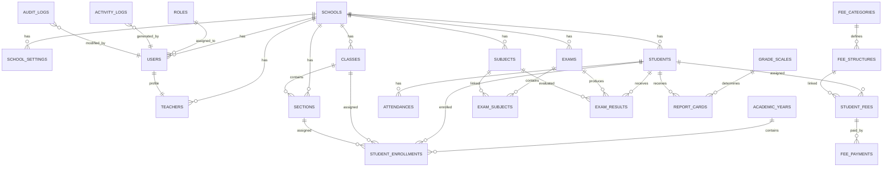

# ENTITY RELATIONSHIP DIAGRAM (ERD)

Project:
Multi-Tenant School Administration Management SaaS Platform

Framework:
Laravel 13

Database:
MySQL 8

Architecture:
Single Database Multi-Tenant SaaS

Tenant Identifier:
school_id

---

# Purpose

This document defines the logical Entity Relationship Diagram (ERD) for the Multi-Tenant School Administration Management SaaS Platform.

The ERD illustrates the relationships between major database entities and serves as the foundation for:

* Database Migrations
* Eloquent Models
* Foreign Key Design
* System Architecture
* MCA Project Report

---

# High-Level Entity Relationships



---

# Core Entity Overview

## School

Primary Tenant Entity

Relationship:

School
├── Users
├── Teachers
├── Students
├── Classes
├── Sections
├── Subjects
├── Exams
└── Settings

Every business record belongs to a school.

---

## User Management

```text
Roles
│
└── Users
     │
     └── Teachers
```

Roles:

* Super Admin
* School Admin
* Teacher
* Accountant

---

## Academic Structure

```text
Academic Year
│
├── Classes
│   │
│   └── Sections
│
└── Student Enrollments
        │
        └── Students
```

Purpose:

Track student movement across academic years without modifying historical records.

---

## Attendance Structure

```text
Students
    │
    └── Attendances
```

One student can have many attendance records.

---

## Fee Structure

```text
Fee Categories
      │
      └── Fee Structures
               │
               └── Student Fees
                        │
                        └── Fee Payments
```

Purpose:

Support flexible fee assignment and payment tracking.

---

## Examination Structure

```text
Exams
│
├── Exam Subjects
│
└── Exam Results
        │
        └── Report Cards
```

Purpose:

Manage examinations, marks, grading, and final results.

---

# Key Foreign Keys

| Table        | Foreign Key |
| ------------ | ----------- |
| users        | school_id   |
| teachers     | school_id   |
| students     | school_id   |
| classes      | school_id   |
| sections     | school_id   |
| subjects     | school_id   |
| exams        | school_id   |
| attendances  | school_id   |
| fee_payments | school_id   |
| exam_results | school_id   |

---

# Tenant Isolation Rule

Every business table must contain:

school_id

Examples:

* students.school_id
* attendances.school_id
* exams.school_id
* fee_payments.school_id
* report_cards.school_id

This ensures complete tenant-level data isolation.

---

# Cardinality Summary

| Relationship                | Type        |
| --------------------------- | ----------- |
| School → Users              | One to Many |
| School → Students           | One to Many |
| School → Classes            | One to Many |
| Class → Sections            | One to Many |
| Student → Attendances       | One to Many |
| Student → Student Fees      | One to Many |
| Student → Exam Results      | One to Many |
| Exam → Exam Subjects        | One to Many |
| Subject → Exam Results      | One to Many |
| Role → Users                | One to Many |
| Academic Year → Enrollments | One to Many |

---

# ER Diagram Design Principles

* Fully normalized database structure
* Tenant-aware architecture
* Soft delete support
* Audit-friendly design
* Scalable SaaS architecture
* Laravel Eloquent relationship friendly
* MySQL 8 optimized

---

# Next Step

After ER Diagram approval:

1. Create SYSTEM_ARCHITECTURE.md
2. Define Laravel migrations
3. Create Eloquent models
4. Define relationships
5. Begin Authentication & RBAC implementation

```
```
